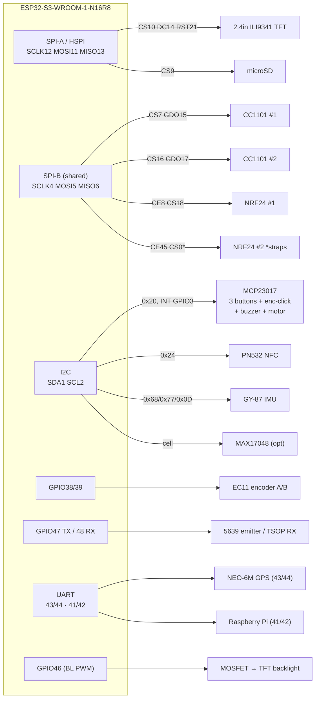
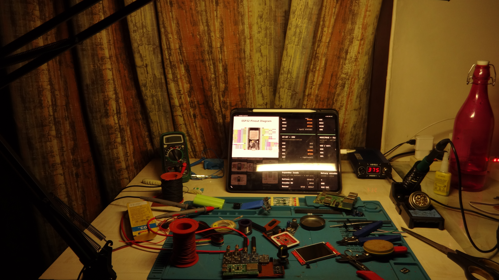
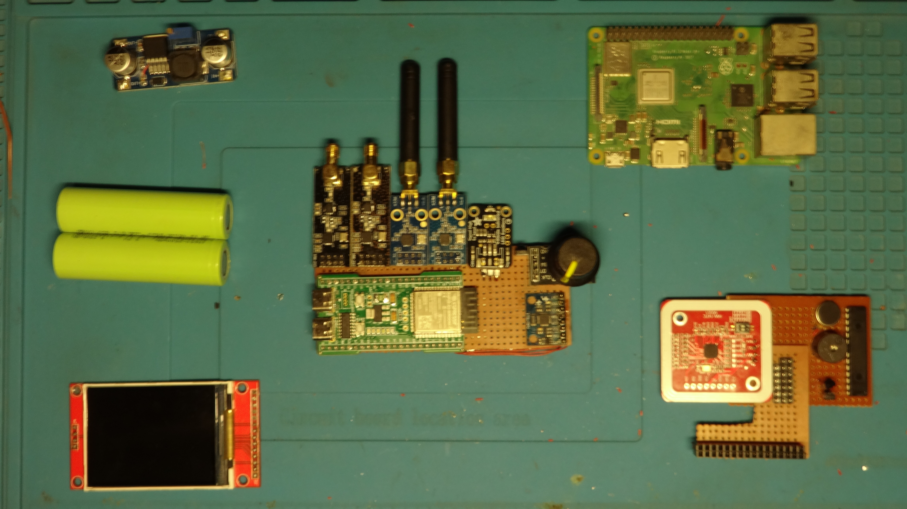
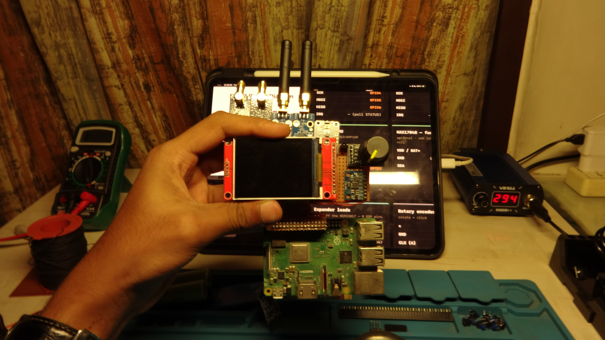
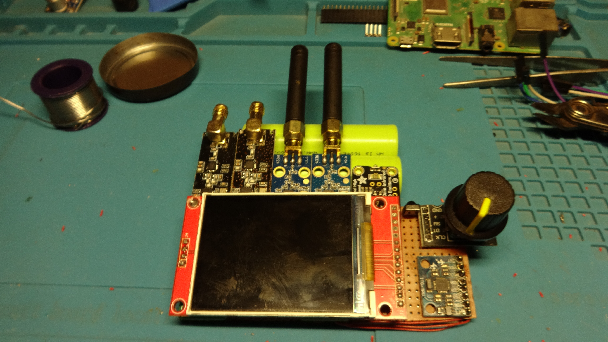

# Edgehax S3-PRO — Multi-Radio Security Handheld

Custom **Flipper-class firmware** for an ESP32-S3 handheld that reads, decodes and (where legal)
replays the wireless world around you: sub-GHz, 2.4 GHz, 13.56 MHz NFC, and IR — plus native
WiFi/BLE/USB. The UI is **interpretation-first**: the screen tells you *what* a signal is in plain
language, with the raw MHz/hex one click away.

> ⚠️ **Personal security-research device.** Use it **only** against hardware, cards and networks
> you **own or are explicitly authorized to test**. It ships **no** jammers and **no** rolling-code
> theft — those live in the "red zone" as documentation only, never as code. You are responsible
> for complying with your local radio (ISM/WiFi power), wiretap and computer-misuse laws.

- **Hardware:** ESP32-S3-WROOM-1-**N16R8** (16 MB flash, 8 MB octal PSRAM) on the *Edgehax S3-PRO* carrier
- **Radios:** 2× CC1101 (sub-GHz) · 2× NRF24L01+ (2.4 GHz) · PN532 (NFC) · IR TX/RX · native WiFi + BLE + USB-OTG
- **UI:** LVGL 8.3 on a 2.4″ ILI9341, driven by a rotary encoder + 3 buttons — **61 tools across 13 categories**
- **Firmware:** PlatformIO + Arduino-ESP32, GPL-3.0, fully original (no vendored code), 54 host unit tests

---

## Table of contents

1. [How to read this repo](#how-to-read-this-repo)
2. [Bill of materials (BOM)](#bill-of-materials-bom)
3. [How it works — architecture](#how-it-works--architecture)
4. [System wiring diagram](#system-wiring-diagram)
5. [Full pinout / wiring tables](#full-pinout--wiring-tables)
6. [Driver circuits (buzzer, motor, backlight)](#driver-circuits)
7. [Power & decoupling — read before you power on](#power--decoupling)
8. [Build, flash & first boot](#build-flash--first-boot)
9. [Build photos](#build-photos)
10. [Firmware layout](#firmware-layout)
11. [Feature maturity — what "working" means](#feature-maturity)
12. [Testing](#testing)
13. [Safety, legal & the red zone](#safety-legal--the-red-zone)
14. [Licensing & credits](#licensing--credits)
15. [Reference pinouts (external)](#reference-pinouts-external)

---

## How to read this repo

If you want to **rebuild this device from scratch**, go in this order:

1. **[BOM](#bill-of-materials-bom)** — buy the parts.
2. **[Wiring tables](#full-pinout--wiring-tables)** + **[system diagram](#system-wiring-diagram)** — wire the ESP32-S3 to every module. Every pin comes from `include/pins.h`, the single source of truth.
3. **[Driver circuits](#driver-circuits)** — the three tiny transistor/MOSFET circuits (buzzer, vibration motor, backlight dimming).
4. **[Power & decoupling](#power--decoupling)** — the caps and voltage rules that stop you from bricking a radio.
5. **[Build, flash & first boot](#build-flash--first-boot)** — install PlatformIO, compile, upload, insert an SD card, done.
6. **`docs/BRINGUP.md`** — the on-device checklist to verify each radio actually works after assembly.

---

## Bill of materials (BOM)

Prices are **approximate typical INR** (Indian hobbyist market) and vary — treat as a planning guide, not a quote.

### Core

| Qty | Part | Role | ≈ INR | Notes |
|----|------|------|------|-------|
| 1 | **Edgehax S3-PRO carrier board** (ESP32-S3-WROOM-1-**N16R8**) | MCU + carrier | 900–1300 | 16 MB flash / 8 MB octal PSRAM. GPIO 26–37 are reserved for flash+PSRAM — never use. |
| 1 | **2.4″ ILI9341 TFT**, 240×320, SPI | Display | 250–400 | On SPI-A. Backlight ships tied to 3V3 (always on) — see the [backlight mod](#driver-circuits). |
| 1 | **microSD card** (FAT32) | Captures + config | 150–300 | Slot is on the carrier, shares SPI-A with the display (own CS on GPIO9). |
| 1 | **Li-ion / LiPo cell** (3.7 V, ~2000–5000 mAh) + TP4056-class charger | Power | 300–600 | Firmware runs directly off the cell in v1. |

### Radios

| Qty | Part | Role | ≈ INR | Notes |
|----|------|------|------|-------|
| 2 | **CC1101** module | Sub-GHz 300–928 MHz (433/315/868) | 150–250 ea | 3.3 V **max** (abs 3.6 V) — 5 V destroys it. SPI-B. |
| 2 | **NRF24L01+** (get the **PA+LNA + antenna** version) | 2.4 GHz | 120–300 ea | 3.3 V max. **Needs 10 µF + 100 nF right at each module** (TX brown-out is the #1 failure). PA+LNA takes range 10 m → 100 m–1 km. SPI-B. |
| 1 | **PN532 NFC module** (the "**HW-147C**" board) | 13.56 MHz read/clone/emulate | 200–350 | Wired as **I2C** (addr 0x24). IRQ/RST pads left open — we poll. |

### Infrared

| Qty | Part | Role | ≈ INR | Notes |
|----|------|------|------|-------|
| 1 | **Adafruit 5639** high-power IR emitter (onboard FET) | IR **TX** | 200–350 | Draws 200 mA@3.3 V pulsing — powers from the battery/5 V rail, **not** the MCU LDO. Add a 100 µF bulk cap. *Not* the bare Adafruit 387 LED. |
| 1 | **TSOP38238 / VS1838B** 38 kHz receiver | IR **RX** | 30–60 | OUT → GPIO48. |

### Input & expansion

| Qty | Part | Role | ≈ INR | Notes |
|----|------|------|------|-------|
| 1 | **EC11 rotary encoder** (with push) | Scroll / select | 30–60 | A/B on native GPIO38/39 (interrupt). Push (SW) goes to the MCP23017. |
| 3 | **Tactile buttons** | BACK / HOME / ACTION | 5 ea | On the MCP23017 (GPA0–GPA2). |
| 1 | **MCP23017** I2C GPIO expander | Buttons, click, buzzer, motor | 60–120 | Addr 0x20 (A0/A1/A2 → GND). One INT line (GPIO3) wakes all inputs. |

### Sensors & optional companions

| Qty | Part | Role | ≈ INR | Notes |
|----|------|------|------|-------|
| 1 | **GY-87 IMU** (MPU6050 + BMP180 + QMC5883L) | Motion / heading / pressure | 150–250 | I2C. Mag sits **behind** the MPU6050 aux bus → `setI2CBypassEnabled(true)`; mag is usually **QMC5883L @0x0D** (scan both 0x0D and 0x1E). MPU 0x68, BMP180 0x77. |
| 1 | **MAX17048** fuel gauge | Battery % | 100–200 | **Optional / deferred in v1.** Powers from the *cell*, not 3V3 — check its pull-ups don't drag the 3.3 V bus above 3.6 V. |
| 1 | **NEO-6M GPS** | Wardrive / geotag | 250–400 | Optional. UART (43/44). |
| 1 | **Raspberry Pi 3B+** (docked) | Heavy-lift companion (SDR decode, cracking) | — | Optional. UART link (41/42). Native ESP32 BLE covers phone comms — an external BT-05 is **not** needed. |

### Audio, haptics & driver parts (your own passives)

| Qty | Part | Role | Notes |
|----|------|------|-------|
| 1 | **MAX98357A** I2S amp + small speaker | Audio out | Uses the ESP32 core's built-in I2S driver. |
| 1 | Active buzzer | Beeps | Driven via a BC547 — see [circuits](#driver-circuits). |
| 1 | Vibration motor | Haptics | Driven via BC547 + 1N4007 flyback. |
| 2 | **BC547** NPN transistors | Low-side drivers | Buzzer + motor. |
| 1 | **1N4007** diode | Motor flyback | Across the motor. |
| 1 | **N-channel MOSFET** (2N7000 / AO3400) | Backlight PWM | For the dimming mod. |
| — | 1 kΩ resistors, 10 µF / 100 nF / 100 µF caps | Bias + decoupling | See [power notes](#power--decoupling). |

> **Dropped on purpose:** 125 kHz LF RFID (EM4100/HID Prox) — there's no LF front-end on this board. Adding read-only LF later means an RDM6300 (~₹150) on a spare UART pin; cheap integrated LF *write* doesn't exist in this form factor.

---

## How it works — architecture

The firmware is a single Arduino-ESP32 app. The design splits work across **two SPI buses** and **both CPU cores** so the fast display never fights the slow radios:

- **SPI-A (HSPI, fast, 40 MHz)** — the ILI9341 display **and** the onboard microSD (each with its own chip-select). The display driver is TFT_eSPI (configured entirely through `platformio.ini` build flags, so no library files are edited).
- **SPI-B (bit-rate-limited, shared)** — all four radios (2× CC1101, 2× NRF24) share SCLK/MOSI/MISO, each with its own CS/CE. Per-device `SPISettings` cap the clock (CC1101 ≤ 6.5 MHz, NRF24 ≤ 10 MHz).
- **I2C** — MCP23017 (inputs), PN532 (NFC), GY-87 (IMU), MAX17048 (fuel gauge).
- **Native GPIO** — rotary encoder (interrupt-driven quadrature), IR TX/RX, UARTs (GPS, Pi).
- **UI** — LVGL 8.3 renders a Death Note-themed charcoal/slate/off-white pixel-art UI, with a 4-digit PIN lock screen and L/Light/Ryuk/Misa mascot reactions on key moments (see `src/sprites.h`, `src/ui_mascot.h`, `src/ui_lock.h`). A data-driven menu (13 categories → tools) is navigated with the encoder (move) + click (select) + BACK/HOME/ACTION. Editing (brightness, TX intensity, PIN) uses an encoder edit-mode.
- **Power manager** — an idle state machine (`pm_tick()`): active → dim → light-sleep, with GPIO wake on the encoder and the MCP INT line. Backlight dimming needs the [MOSFET mod](#driver-circuits) (until then it's a no-op and the panel stays lit).
- **Global intensity** — one setting scales TX power for **every** radio at once: Low / Medium / **Max** (CC1101 dBm, NRF24 PA level, WiFi TX power all move together).

### Interactive UI preview

There's a browser simulator of the exact on-device UI (private artifact, for the maintainer):
`https://claude.ai/code/artifact/f37906e6-18be-467a-8780-ce8373aeddbd` — click rows, turn the encoder, open tools.

---

## System wiring diagram



---

## Full pinout / wiring tables

**All values are from `include/pins.h`.** Reserved (never use): **GPIO 26–32** (SPI flash), **33–37** (octal PSRAM).

### SPI-A — display + microSD (fast bus)

| ESP32-S3 GPIO | Signal | Goes to |
|---|---|---|
| 12 | SCLK | TFT SCK **+** SD SCK |
| 11 | MOSI | TFT SDI **+** SD MOSI |
| 13 | MISO | TFT SDO **+** SD MISO |
| 10 | TFT CS | TFT CS |
| 14 | TFT DC | TFT DC/RS |
| 21 | TFT RST | TFT RESET |
| 9 | SD CS | microSD CS |
| 46 | Backlight PWM | TFT LED via MOSFET (see mod) |

*(TFT pins are set in `platformio.ini` via TFT_eSPI build flags; the rest live in `pins.h`.)*

### SPI-B — the four radios (shared SCLK/MOSI/MISO)

| ESP32-S3 GPIO | Signal | Module |
|---|---|---|
| 4 | SCLK | all four |
| 5 | MOSI | all four |
| 6 | MISO | all four |
| 7 | CS | CC1101 #1 |
| 15 | GDO0 | CC1101 #1 |
| 16 | CS | CC1101 #2 |
| 17 | GDO0 | CC1101 #2 |
| 8 | CE | NRF24 #1 |
| 18 | CSN | NRF24 #1 |
| 45 | CE | NRF24 #2 — **strap pin, add 10k pulldown** |
| 0 | CSN | NRF24 #2 — **BOOT strap, keep the pull-up** |

> NRF24 #2 sits on two strapping pins (GPIO0 = BOOT, GPIO45). It works, but respect the strap rules above or the board won't boot.

### I2C bus (SDA 1 / SCL 2 @ 400 kHz)

| Device | Addr | Notes |
|---|---|---|
| MCP23017 | 0x20 | A0/A1/A2 → GND. INT (INTA) → GPIO3. |
| PN532 (HW-147C) | 0x24 | IRQ/RST pads open — driver args point at the unused LED pin (GPIO40); we poll. |
| MPU6050 (GY-87) | 0x68 | |
| BMP180 (GY-87) | 0x77 | |
| QMC5883L (GY-87 mag) | 0x0D | Behind MPU aux bus → enable I2C bypass. Scan 0x1E too (HMC5883L variant). |
| MAX17048 | 0x36 | Optional; powers from the cell. |

### MCP23017 port-A assignments

| MCP pin | GPA# | Function |
|---|---|---|
| GPA0 | 0 | Button **BACK** |
| GPA1 | 1 | Button **HOME** |
| GPA2 | 2 | Button **ACTION** (silk "SELECT") |
| GPA3 | 3 | Encoder **push** (click) |
| GPA5 | 5 | Buzzer (via BC547) |
| GPA6 | 6 | Vibration motor (via BC547 + flyback) |

### Native GPIO — encoder, IR, UART, LED

| GPIO | Function |
|---|---|
| 38 / 39 | Encoder A (CLK) / B (DT) — interrupt |
| 3 | MCP23017 INT (one IRQ/wake line for all inputs) |
| 47 / 48 | IR TX (5639 emitter) / IR RX (TSOP OUT) |
| 43 / 44 | GPS: ESP TX → GPS RX / ESP RX ← GPS TX |
| 41 / 42 | Pi: ESP TX → Pi RXD / ESP RX ← Pi TXD |
| 40 | Onboard white status LED (plain GPIO, active-driven — **not** addressable) |
| 46 | Backlight PWM (LEDC ch0, 5 kHz, 8-bit) |

---

## Driver circuits

Three small circuits sit between the logic pins and their loads. All three are **low-side switches**:
the transistor/MOSFET pulls the load's negative terminal to ground when the control pin goes high.

### Buzzer — BC547 low-side (MCP GPA5)

```
 MCP GPA5 ──[ 1kΩ ]──┤ B                +3V3
                     BC547 (NPN)          │
                  C ─┴─ E                [Buzzer +]
                  │      │                 │
              [Buzzer -] └──── GND    [Buzzer +] to 3V3, [-] to collector
```

### Vibration motor — BC547 + flyback diode (MCP GPA6)

```
 MCP GPA6 ──[ 1kΩ ]──┤ B          +3V3 (or motor rail)
                     BC547           │
                  C ─┴─ E         [Motor +]────┬──►|── (1N4007, cathode to +)
                  │      │            │         │
              [Motor -]  └── GND   [Motor -] ── C   ← flyback protects the transistor
```
The 1N4007 across the motor clamps the inductive kick when it switches off.

### Backlight dimming mod — N-MOSFET (GPIO46) — *optional but recommended*

The TFT's LED/backlight ships hard-wired to 3V3 (always on, ~40–80 mA — your single biggest current
draw). To let the firmware dim it and sleep it, cut that trace and switch the backlight's low side
with a MOSFET driven by GPIO46:

```
             +3V3
              │
        [ TFT LED anode (+) ]
              │
        [ TFT LED cathode (-) ]
              │
  GPIO46 ─[1kΩ]─┤ G   (N-ch MOSFET, e.g. AO3400 / 2N7000)
              D ─┴─ S
              │      │
            (to LED-) └── GND
```
Until you do this mod, the `PIN_BL_PWM` code is a harmless no-op and the panel stays fully lit
(runtime ~5–7 h). With it, auto-dim + sleep gets you 10 h+ on a 5000 mAh cell.

---

## Power & decoupling

Read this **before** first power-on — these are the mistakes that kill parts:

- **CC1101 and NRF24 are 3.3 V devices** (absolute max 3.6 V). Putting 5 V on them destroys them.
- **Every NRF24 needs 10 µF + 100 nF** soldered right at its VCC/GND pins. Skipping this causes TX brown-out resets — the single most common "my NRF24 doesn't work" cause. PA+LNA modules are worse offenders.
- **The IR emitter (Adafruit 5639)** pulses ~200 mA@3.3 V (400 mA@5 V). Feed it from the **battery/5 V rail**, not the MCU's LDO, and add a **100 µF bulk cap** near it. Otherwise its current spikes brown out the ESP32.
- **MAX17048** measures the LiPo directly — it's powered from the **cell**, not the 3V3 rail. Verify its onboard pull-ups don't reference the 4.2 V battery (that would drag the 3.3 V I2C bus above the ESP32's 3.6 V limit).
- **Strapping pins in use:** GPIO0 (NRF24 #2 CSN — keep BOOT pull-up), GPIO45 (NRF24 #2 CE — add 10 k pulldown), GPIO46 (backlight — free after boot). Wire these per the notes or the board won't boot.

---

## Build, flash & first boot

### 1. Toolchain

Install **[PlatformIO](https://platformio.org/)** (VS Code extension, or the `pio` CLI). It pulls the
ESP32 platform, the Arduino framework and every library in `platformio.ini` automatically — **nothing
is vendored**, so a clean checkout builds from `lib_deps` alone.

```bash
git clone git@github.com:kavin-jain/s3-handheld.git
cd s3-handheld
```

### 2. Test (pure logic, host g++ — no hardware needed)

```bash
bash test/run_all.sh          # compiles & runs all 54 host suites, twice each
```

### 3. Compile

```bash
pio run                       # builds for esp32-s3-devkitc-1 (N16R8 settings baked in)
```

### 4. Flash + serial monitor

```bash
pio run -t upload && pio device monitor   # upload over native USB, then watch @115200
```
The project sets `ARDUINO_USB_CDC_ON_BOOT=1`, so `Serial` comes out of the **native USB-C** port
(not the UART bridge). If upload fails, hold **BOOT**, tap **RESET**, release BOOT, and retry.

### 5. First boot (plug-and-play)

1. Insert a **FAT32 microSD**. Captures auto-save to `/subghz`, `/nfc`, `/ir`, `/wifi`, `/badusb`; settings persist to `/config.txt`.
2. **IR remotes:** drop the public-domain [Flipper-IRDB](https://github.com/Lucaslhm/Flipper-IRDB) (CC0) — or your own Flipper's `/ir` folder — onto the card. The universal remote reads it via `src/flipper_ir.h`. **No database is bundled in this repo.**
3. **NFC keys:** drop a `keys.dic` (one hex key per line) under `/nfc` to extend the Mifare dictionary crack beyond the built-in defaults.
4. **Settings → Intensity** sets TX power for *every* radio: Low / Medium / **Max** (default). **Max can exceed local ISM/WiFi limits — run only where you're permitted.**
5. Controls: **rotary = move/adjust · click = select · BACK / HOME / ACTION** (ACTION saves a capture).

---

## Build photos

Bench assembly, radio wiring and the ILI9341 UI running live:

<p>
  
  
</p>
<p>
  
  
</p>

---

## Firmware layout

`main.cpp` is the UI shell only; every driver and app is its own module. Pure logic (parsers,
decoders, frame builders, key iteration, path builders) lives in headers with a matching host test.

| Area | Files |
|---|---|
| Pin map (source of truth) | `include/pins.h` |
| LVGL config | `include/lv_conf.h` |
| UI shell + power manager | `src/main.cpp` |
| Storage / SD layer | `storage*.{h,cpp}`, `strutil.h` |
| Sub-GHz (CC1101) | `radio_cc1101.*`, `subghz_classify.h`, `subghz_replay.h`, `pt2262.h`, `wmbus.h` |
| NFC (PN532) | `nfc_pn532.*`, `mifare.h`, `nfc_keys.h`, `ndef.h`, `emv.h`, `transit.h`, `amiibo.h`, `ibutton.h` |
| IR | `ir_remote.*`, `irdb.h`, `ir_codes.h`, `ac_db.h`, `ac_state.h`, `flipper_ir.h`, `tvbgone.*` |
| WiFi | `wifi_scan.*`, `deauth_detect.*`, `evilportal.h`, `handshake.h`, `karma.h`, `wardrive.h`, `wifi_fmt.h` |
| BLE | `ble_scan.*`, `ble_track.h`, `gatt_uuid.h`, `wof.h` |
| NRF24 / 2.4 GHz | `nrf24_radio.*`, `nrf_band.h`, `mousejack.h`, `hid_encode.h`, `hid_keymap.h` |
| BadUSB / HID | `badusb.*`, `ducky.h` |
| Counter-surveillance | `camera_detect.h`, `audiobug.h`, `skimmer.h`, `droneid.h`, `deauth_detect.*` |
| Sensing | `csi_motion.h`, `df_logic.h` |
| Pranks / comms / me | `gags.h`, `hackscreen.h`, `ssdp.h`, `espnow_*.{h,cpp}`, `usbhost.h`, `fwdump.h`, `buspirate.h`, `gpio_util.h`, `ical.h`, `tasks.h`, `usage_fmt.h` |
| Power / intensity | `power_ctl.*`, `power_level.h`, `config.h` |

---

## Feature maturity

Every feature moves through three gates, and is only called **working** at the third — on real
hardware, against a real target:

```
compiles  →  pure logic host-unit-tested  →  on-device bring-up verified
```

Radio/NFC/IR I/O in this repo is **compile-verified and logic-tested**, and awaits on-device
bring-up (tracked in `docs/BRINGUP.md`). Nothing here claims to "work" on RF it hasn't been run
against. The full curated capability matrix is **61 buildable tools across 13 categories**, plus a
documented **red zone** that is intentionally never built.

---

## Testing

```bash
bash test/run_all.sh
```
Compiles and runs **54 host suites** (plain `g++ -std=c++17`, each run twice) covering every pure
function — parsers, decoders, frame/key builders, path logic. No hardware, no framework, no fixtures.
The suite is green on `main`.

---

## Safety, legal & the red zone

This device can transmit. That is a legal responsibility, not a toggle.

- **Green-zone tools** (scan, read, decode, replay against your own gear, deauth your own AP) are built and shipped. Max intensity can exceed ISM/WiFi power limits — that's a "where are you allowed" question, not a "can the hardware" one.
- **Red-zone concepts** — jamming, RollJam / rolling-code theft, IMSI-catching, card skimming for fraud, unlicensed high-power TX — are **documented as concepts only and never implemented in code.** The scanner confirms this: there is no jammer, no RollJam, no IMSI routine in `src/`. The only "jam" strings are in the *defensive* deauth **detector** ("is someone jamming me?").
- Use only against targets you own or are authorized to test. Comply with your local radio, wiretap and computer-misuse law.

---

## Licensing & credits

- **Firmware: GPL-3.0** (it links GPL libraries such as RF24). See `LICENSE`.
- All code here is **original**, written against the libraries in `platformio.ini`. Upstream projects (HIZMOS, Bruce/Marauder) were read **only as reference** and are **not** copied in — HIZMOS ships with no license, Bruce is AGPL-3.0; vendoring either would be a licensing problem. `_refs/` (those clones) is gitignored and never committed.
- **IR database:** none bundled. The firmware ships only an original `.ir` parser + sender; you supply the CC0 [Flipper-IRDB](https://github.com/Lucaslhm/Flipper-IRDB) on the SD card.
- Full third-party license list: **`NOTICE`**.

---

## Reference pinouts (external)

Rather than embed copyrighted pinout images, here are the **official** module pinouts to keep open
while wiring (their diagrams are the authoritative source — always trust the datasheet over any
third-party image):

| Part | Where to get the authoritative pinout |
|---|---|
| ESP32-S3-WROOM-1 | Espressif *ESP32-S3-WROOM-1 Datasheet* (pin definitions table) |
| ILI9341 2.4″ TFT | Module vendor's product page / the ILI9341 datasheet |
| CC1101 | TI *CC1101 Datasheet* + your module's silk |
| NRF24L01+ | Nordic *nRF24L01+ Product Specification* |
| PN532 (HW-147C) | NXP *PN532 User Manual (UM0701)*; note this specific board's I2C jumper positions |
| MCP23017 | Microchip *MCP23017 Datasheet* (GPA/GPB tables) |
| GY-87 | InvenSense MPU-6050 + Bosch BMP180 + QST QMC5883L datasheets |
| TSOP38238 | Vishay *TSOP382xx Datasheet* |

> Tip for a rebuilder: print this repo's [wiring tables](#full-pinout--wiring-tables) and check off each
> row as you solder. The `include/pins.h` file is the machine-readable version of the same map.
